# Image Processing Service

Сервис для восстановления и улучшения качества старых фотографий.

Проект объединяет классические методы обработки изображений и нейросетевые модели,
предоставляя гибкий инструмент для улучшения визуального качества фотографий
с сохранением их исходного характера.

## Возможности

Сервис позволяет выполнять следующие операции над изображениями:

- **Устранение небольшого шума и выраженной зернистости фотоплёнки (denoise)**  
  Мягкое подавление шумов без агрессивного сглаживания деталей.

- **Устранение размытия и коррекция фокуса (deblur)**  
  Восстановление резкости изображений после стадии denoise, а также коррекция неточного фокуса.

- **Масштабирование изображения без потери качества или повышение детализации
  с сохранением исходного размера (upscale)**  
  Увеличение разрешения либо улучшение детализации без изменения габаритов изображения.

- **Раскрашивание чёрно-белых фотографий (colorization)**  
  Автоматическое добавление цвета к монохромным изображениям.

- **Финальная постобработка**  
  Лёгкая стабилизация изображения, сглаживание и повышение резкости перед сохранением результата.


## Режимы работы

Сервис поддерживает два режима работы, ориентированных на разные сценарии использования:
**простой** — для быстрого и удобного восстановления,
**продвинутый** — для гибкой настройки этапов обработки.

---

### Простой режим

Предназначен для пользователей, которым важно быстро получить
качественный результат без необходимости разбираться в деталях обработки.

**Что делает:**
- автоматически применяет основной пайплайн восстановления изображения;
- позволяет выбрать режим масштабирования изображения;
- опционально включает раскрашивание чёрно-белых фотографий.

**Особенности:**
- минимальное количество настроек;
- последовательность обработки заранее определена;
- подходит для большинства типовых старых фотографий.

**Как реализован:**
- используется фиксированный порядок этапов обработки;
- параметры моделей и классических алгоритмов заданы по умолчанию;
- пользователь управляет только ключевыми флагами (например, включение раскрашивания и режим апскейла).

---

### Продвинутый режим

Предназначен для пользователей, которым требуется больший контроль
над процессом обработки изображения.

**Что делает:**
- позволяет включать и отключать отдельные этапы обработки;
- даёт возможность изменять состав пайплайна обработки;
- подходит не только для старых фотографий, но и для обычных изображений.

**Доступные этапы:**
- устранение размытия (deblur);
- раскрашивание чёрно-белых изображений;
- масштабирование изображения;
- постобработка после апскейла;
- повышение резкости.

**Как реализован:**
- каждый этап обработки представлен независимым модулем;
- пайплайн собирается динамически на основе выбранных пользователем параметров;
- все этапы могут использоваться как совместно, так и по отдельности.

---

### Финальная настройка результата

Независимо от выбранного режима, после основной обработки пользователь может выполнить
онлайн-постобработку изображения перед сохранением результата.

**Доступные настройки:**
- дополнительное сглаживание изображения;
- регулировка резкости;
- моментальный предпросмотр изменений.


## Архитектура пайплайна

Обработка изображения в сервисе построена в виде последовательного пайплайна,
где каждый этап решает отдельную задачу.
Все этапы реализованы в виде независимых модулей и могут использоваться
как совместно, так и по отдельности (в продвинутом режиме).

Общая схема пайплайна:

input → denoise → deblur → colorize → upscale → post-denoise → sharpen → output

**В проекте используются нейросети с открытыми лицензиями.
Все модели применяются исключительно в режиме инференса и не дообучаются
в рамках сервиса.**
### Устранение шума (Denoise)

Используются классические методы обработки изображений,
ориентированные на мягкое сглаживание без потери мелких деталей.
Данный этап не предназначен для восстановления изображений
с сильными повреждениями.
### Устранение размытия и коррекция фокуса (Deblur)

Для обработки используется нейросеть,
автоматически применяемая к изображению без необходимости
ручной настройки параметров пользователем. 

Модель основана на DeblurGAN-v2.

- Репозиторий: https://github.com/VITA-Group/DeblurGANv2
- Лицензия: BSD 2-Clause License
### Раскрашивание чёрно-белых изображений (Colorization)

Для раскрашивания используется нейросетевая модель,
работающая с яркостной компонентой изображения и восстанавливающая
цветовую информацию на основе обученных признаков.

Данная модель представлена в работе
“Colorful Image Colorization” (ECCV 2016).

- Репозиторий: https://github.com/richzhang/colorization
- Лицензия: BSD 2-Clause License
### Масштабирование и повышение детализации (Upscale)

Используется нейросетевая модель апскейла,
ориентированная на сохранение структуры изображения
и предотвращение появления артефактов.

В рамках проекта применяется Python-библиотека, основанная на Real-ESRGAN.

- Основной проект: https://github.com/xinntao/Real-ESRGAN
- Используемая библиотека: realesrgan (Python package)
- Лицензия: BSD 3-Clause License
### Постобработка после апскейла (Post-denoise и Sharpen)
Финальная обработка изображения выполняется в два этапа: автоматическом и ручном онлайн-режиме.
Оба этапа используют классические методы обработки изображений:
- Gaussian Blur — для смягчения резких границ и подавления артефактов,
- Unsharp Mask — для восстановления визуальной чёткости.

#### Автоматическая постобработка

Автоматический этап встроен в основной пайплайн и применяется ко всем изображениям по умолчанию.
Он использует лёгкое гауссово размытие (Post-denoise) с фиксированными параметрами, подобранными как универсальный компромисс для большинства изображений.

При этом универсальные настройки не всегда оптимальны: например, в портретах апскейл может усиливать контуры лица и мелкие детали, из-за чего изображение выглядит излишне резким и неестественным.

#### Ручная онлайн-постобработка

Для более точной настройки результата предусмотрен дополнительный интерактивный этап постобработки.
Пользователь может вручную регулировать степень размытия и силу повышения резкости, подбирая параметры под конкретное изображение.

Ручная постобработка выполняется поверх результата основного пайплайна и позволяет добиться более естественного визуального восприятия, особенно при работе с портретами.
## Ограничения

- Сервис ориентирован на улучшение качества изображений,
  а не на реставрацию фотографий с сильными физическими повреждениями.
- Качество результата зависит от состояния исходного изображения.
- В текущей версии обработка выполняется в CPU-режиме,
  что может влиять на скорость работы.

## Установка и запуск

Проект представляет собой веб-сервис на базе Streamlit и может быть запущен
локально или с использованием Docker.

Для локального запуска необходимо клонировать репозиторий, создать и активировать
виртуальное окружение, установить зависимости и запустить приложение:

```bash
git clone <repository_url>
cd <project_directory>
python -m venv venv
source venv/bin/activate      # Linux / macOS
venv\Scripts\activate         # Windows
pip install -r requirements.txt
streamlit run app.py
```

Для упрощения развёртывания также поддерживается запуск в Docker.
Необходимо собрать Docker-образ и запустить контейнер:

```bash
docker build -t image-processing .
docker run -p 8501:8501 image-processing
```


После запуска контейнера сервис будет доступен по адресу
http://localhost:8501.

## Доступ к сервису

Сервис доступен в двух вариантах:

- Streamlit Cloud: https://imageprocessing-acyqrpj9sen2manjeedbgm.streamlit.app/
Это основной вариант запуска. Но из-за особенностей платформы Streamlit Cloud приложение может некорректно запускаться после сна среды (cold start) из-за повторной инициализации зависимостей. Поэтому был добавлен дополнительный вариант.

- Резервный сервер: http://91.206.15.205:8501
Запуск в Docker-контейнере на собственном сервере. Работает стабильнее, но медленнее (CPU + контейнер). Подключение осуществляется по HTTP, поэтому браузер или антивирус могут выдавать предупреждения — их можно игнорировать.

## Технические параметры
### Требования к входным изображениям

- Формат: JPEG / PNG

- Семантика изображения не ограничена (портреты, пейзажи, сцены и т.д.)

- Максимальный размер изображения: не более 2 000 000 пикселей
(например, ~2000×1000 или эквивалентная площадь)

Ограничение связано с расчётом на CPU-инференс и предназначено для обеспечения
стабильной работы сервиса.

### Время обработки

Зависит от размера изображения, выбранных этапов пайплайна
и вычислительной среды.

Ориентировочное время работы в Streamlit Cloud (CPU):

- изображение ~1 000 000 пикселей — ≈ 15-25 секунд

- изображение ~2 000 000 пикселей (максимальный размер) — ≈ 25–35 секунд

В резервной версии на сервере время обработки может быть выше
из-за контейнеризации и ограничений вычислительных ресурсов.

## Планы развития

В дальнейшем проект может быть расширен и улучшен в следующих направлениях:

- Использование GPU для ускорения инференса нейросетевых моделей и повышения общей производительности сервиса.

- Добавление отдельной нейросетевой модели (например, автоэнкодера), ориентированной на восстановление изображений с выраженными дефектами, где классических методов и стандартного деблюра недостаточно.

- Контейнеризация и оркестрация моделей: разделение пайплайна на независимые Docker-контейнеры, где каждая модель работает в собственной среде.
Это позволит:

  - избежать конфликтов зависимостей,

  - упростить замену и обновление моделей,

  - масштабировать отдельные части приложения,

  - развивать проект модульно.

- Создание более аккуратного и информативного интерфейса, ориентированного на удобство работы и визуальную обратную связь.

- Возможность задавать произвольный коэффициент увеличения изображения, а не только фиксированные значения.

- Использование более мощной и современной модели для раскрашивания изображений для получения более насыщенных, реалистичных и устойчивых цветов.

## Используемые изображения

В демонстрационных примерах используются изображения из открытых источников с разрешёнными лицензиями (Public Domain / permissive licenses).
Изображения применяются исключительно для демонстрации работы сервиса.

## Примеры результатов
<p>
    
    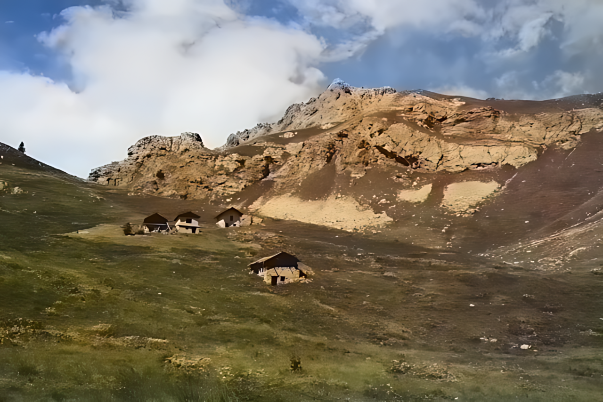
</p>

<p>
    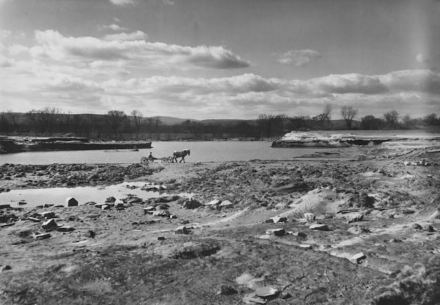
    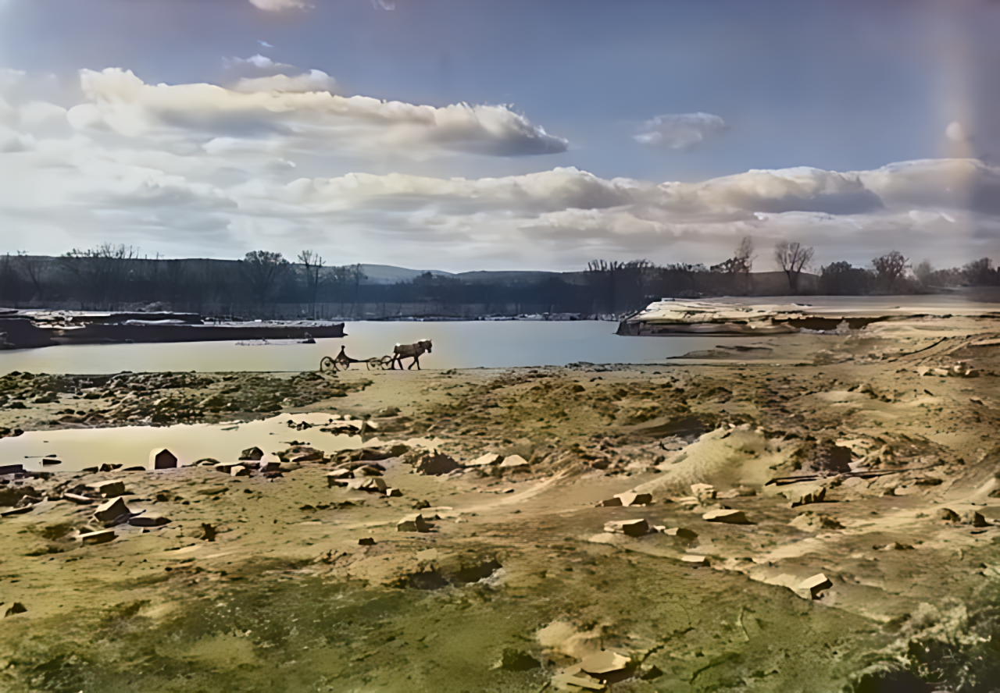
</p>

<p>
    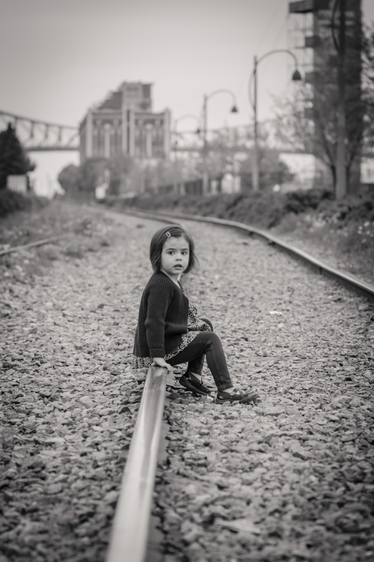
    
</p>

<p>
    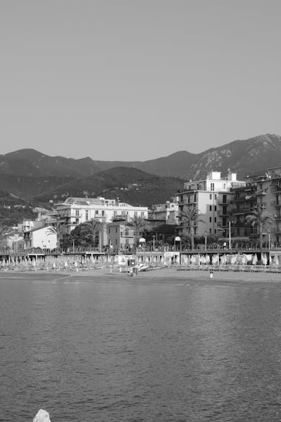
    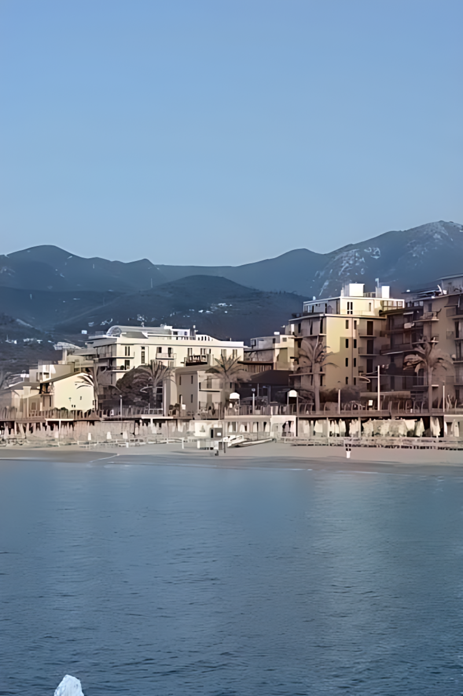
</p>

<p>
    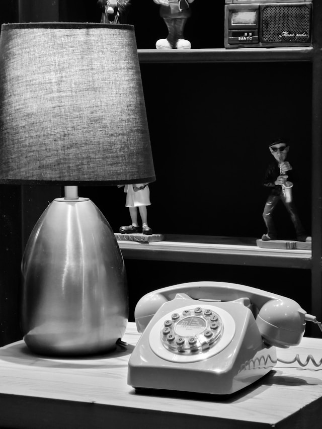
    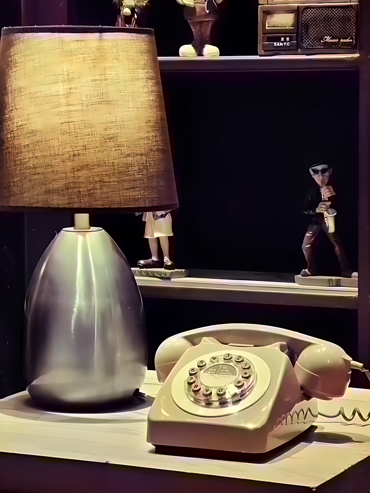
</p>


<p>
    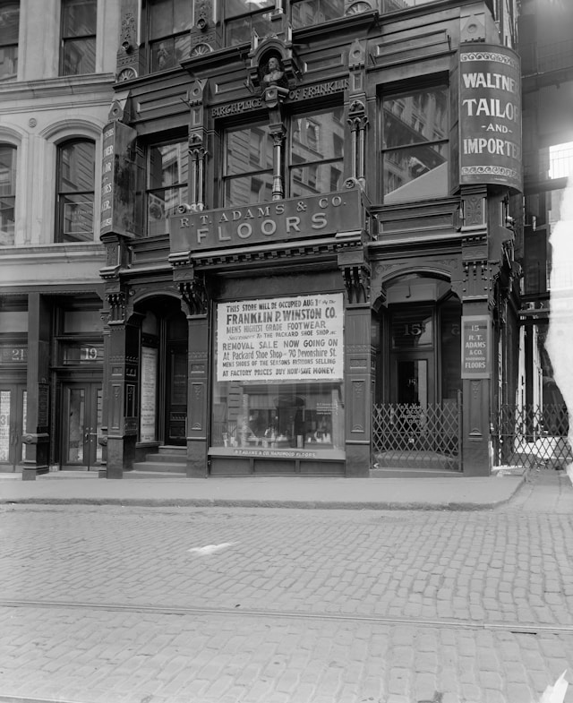
    
</p>

Сервис предназначен для обработки фотографий, однако может быть успешно применён и к рисованным изображениям:
<p>
    
    
</p>

<p>
    
    
</p>

<p>
    
    
</p>

<p>
    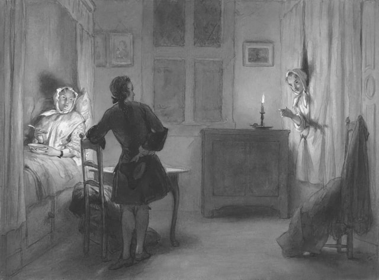
    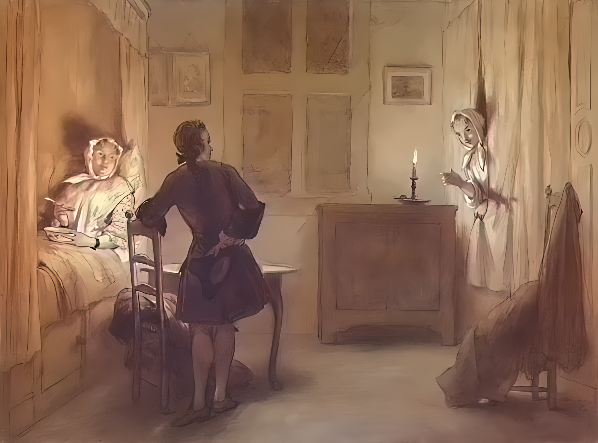
</p>

Дополнительные примеры доступны в папке [examples](examples).


